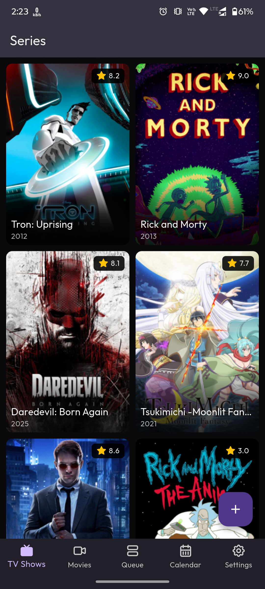
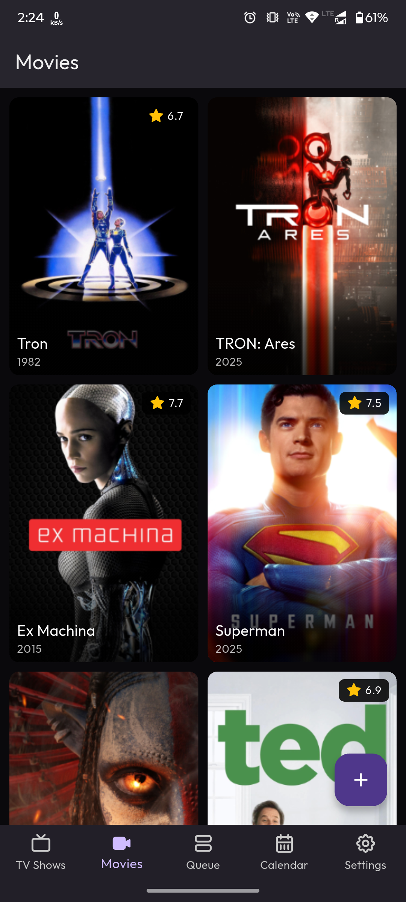
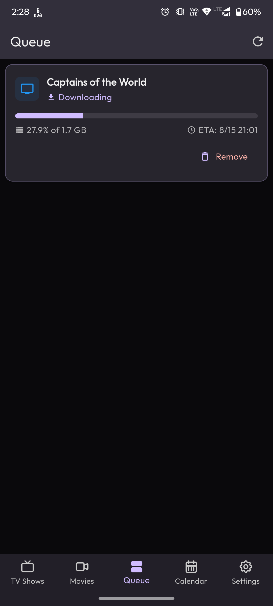
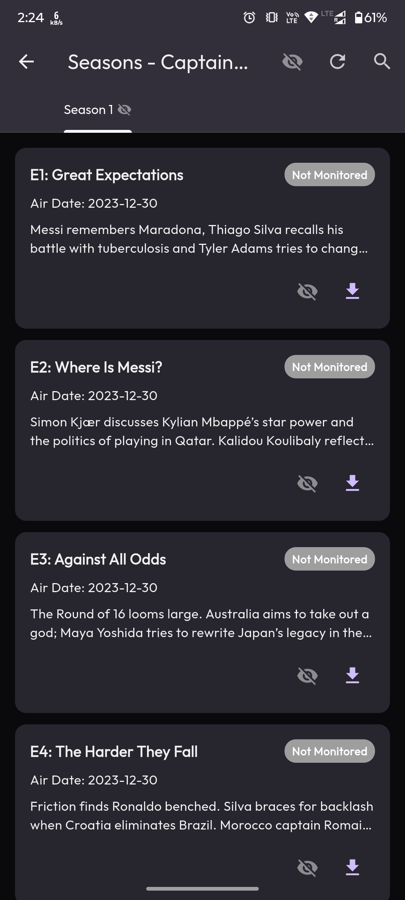
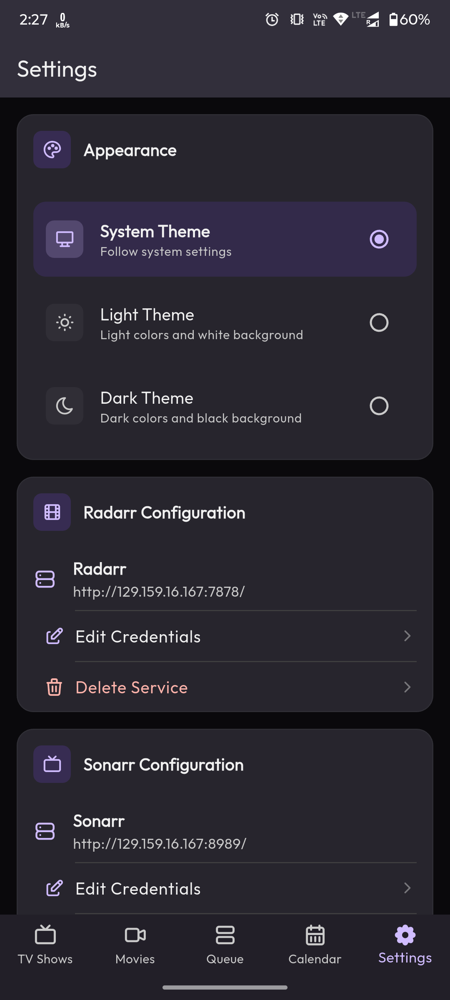

# Orion

A modern, responsive, and feature-rich cross-platform client for Radarr and Sonarr media management systems. Built with Flutter to provide a seamless experience across mobile, desktop, and web platforms.


## Features

- **Multi-platform Support**: Run on Android, iOS, Windows, macOS, Linux, and Web
- **Responsive Design**: Adapts to any screen size with responsive layouts using MasonryGridView and adaptive navigation
- **Unified Media Management**:
  - **Movie Management**: Browse, search, and manage your Radarr movie library
  - **TV Show Management**: Browse, search, and manage your Sonarr TV series library
  - **Download Queue**: View and manage all downloads in a unified interface with status indicators and progress tracking
  - **Comprehensive Calendar**: Track upcoming releases and recently added content
- **Dynamic Theming**: Light and dark theme support using FlexColorScheme
- **Adaptive Layouts**: Responsive grid views that adjust based on screen size
- **Download Management**: Pause, resume, or remove downloads directly from the app

- **Technical Features**:
  - **Riverpod State Management**: Clean architecture with separation of concerns
  - **API Integration**: Direct integration with Radarr and Sonarr APIs


## Screenshots

<table>
  <tr>
    <td></td>
    <td></td>
    <td></td>
  </tr>
  <tr>
    <td></td>
    <td></td>
    <td></td>
  </tr>
</table>

## Installation

### Android
- Download the APK from the [Releases](https://github.com/Not-Dhanraj/test_proj/releases) page
- Enable installation from unknown sources in your device settings
- Install the APK

### iOS

- Build from source using Xcode


## Development

### Prerequisites

- Flutter SDK 3.8.0 or higher
- Dart SDK 3.8.1 or higher
- An IDE (VS Code, Android Studio, or IntelliJ IDEA)

### Setup

1. Clone the repository:
   ```
   git clone https://github.com/Not-Dhanraj/test_proj.git
   cd test_proj
   ```

2. Install dependencies:
   ```
   flutter pub get
   ```

3. Run the app:
   ```
   flutter run
   ```

### Building for Production

#### Android
```
flutter build apk --release
```

#### iOS
```
flutter build ios --release
```

#### Windows
```
flutter build windows --release
```

#### macOS
```
flutter build macos --release
```

#### Linux
```
flutter build linux --release
```

#### Web
```
flutter build web --release
```

## Future Plans

- [ ] Prowlarr integration for managing indexers
- [ ] Lidarr integration for music collection management
- [ ] Enhanced error handling and user feedback
- [ ] Code restructuring for better maintainability
- [ ] Performance optimizations for larger libraries
- [ ] Write proper unit tests
- [ ] Go Router for routing

## Contributing

Contributions are welcome! Please feel free to submit a Pull Request.

1. Fork the repository
2. Create your feature branch (`git checkout -b feature/amazing-feature`)
3. Commit your changes (`git commit -m 'Add some amazing feature'`)
4. Push to the branch (`git push origin feature/amazing-feature`)
5. Open a Pull Request

## License

This project is licensed under the MIT License - see the LICENSE file for details.
