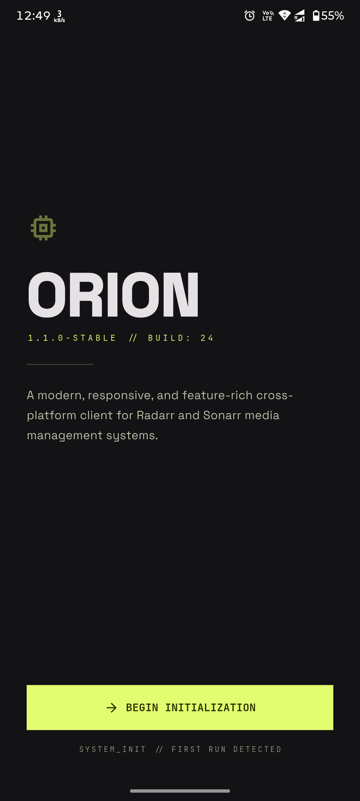
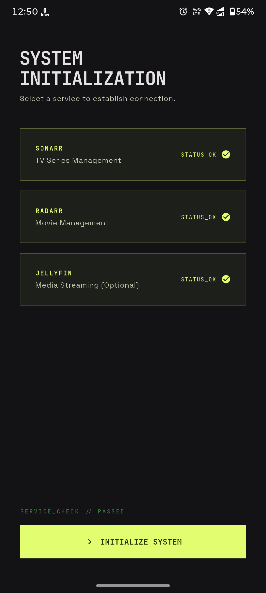
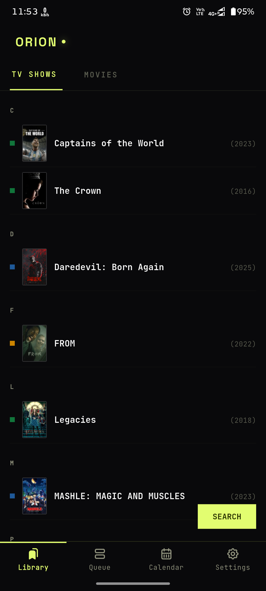
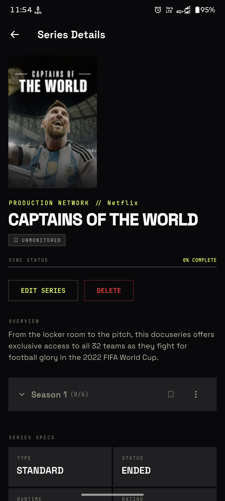
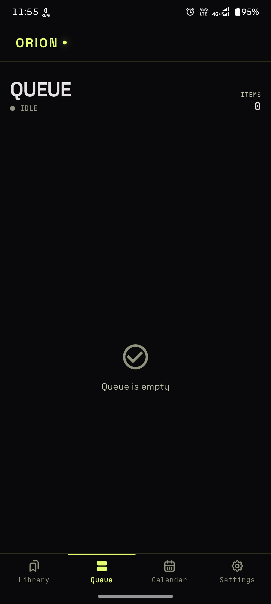
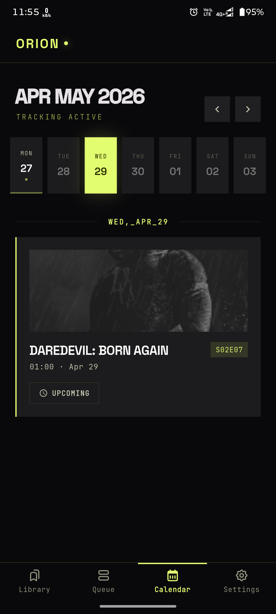
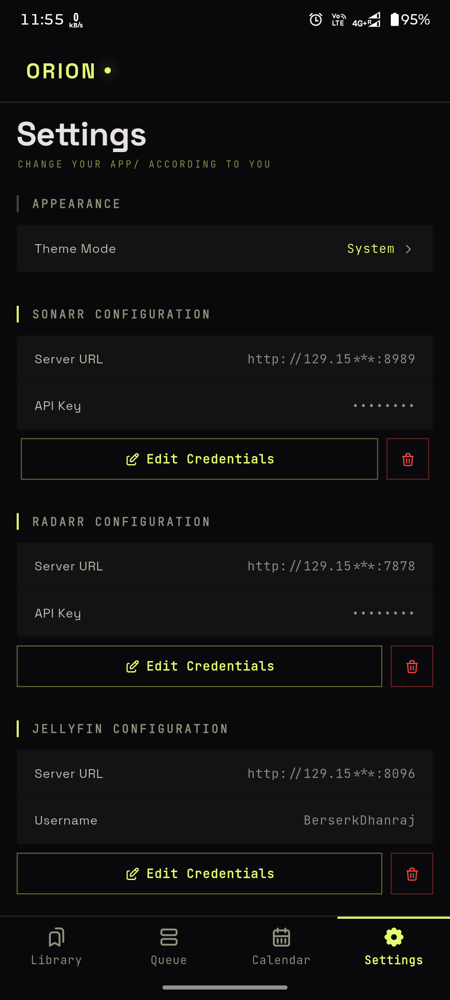
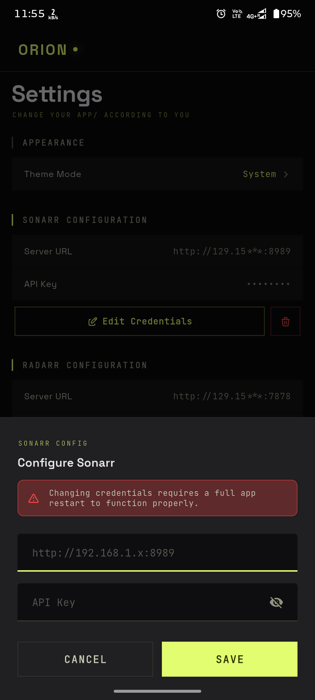
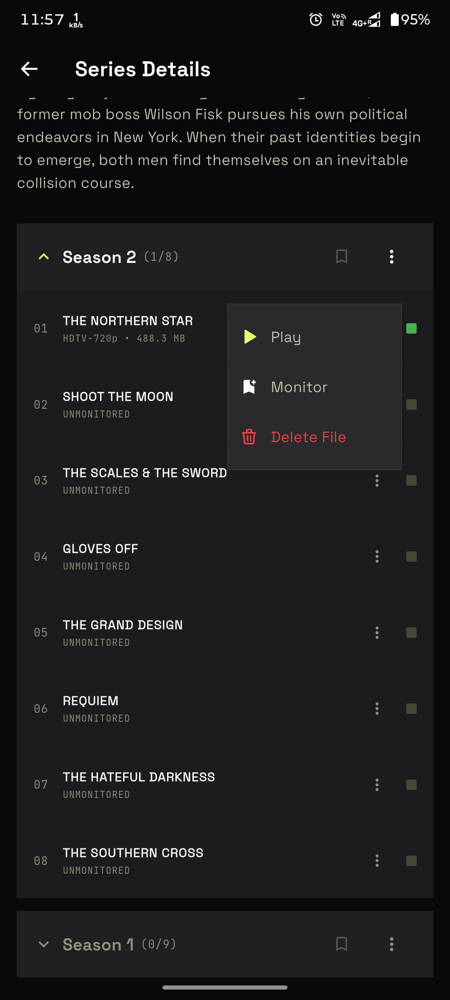
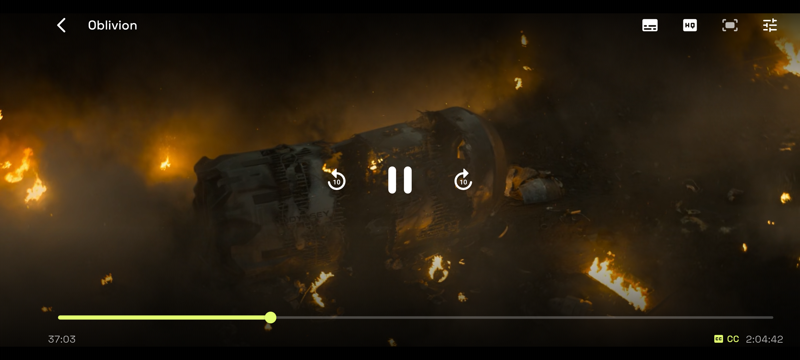

# Orion

A modern, responsive, and feature-rich cross-platform client for Jellyfin, Radarr, and Sonarr media management and playback systems. Built with Flutter to provide a seamless experience across mobile, desktop, and web platforms.


## Features

- **Jellyfin Integration**: Stream and play media directly from your Jellyfin server with a built-in player.
- **Radarr & Sonarr Integration**:
  - **Movie Management**: Browse, search, and manage your Radarr movie library.
  - **TV Show Management**: Browse, search, and manage your Sonarr TV series library.
  - **Download Queue**: View and manage all downloads in a unified interface with status indicators and progress tracking.
- **Multi-platform Support**: Run on Android, iOS, Windows, macOS, Linux, and Web.
- **Responsive Design**: Adapts to any screen size with responsive layouts using adaptive navigation.
- **Dynamic Theming**: Light and dark theme support adapting to your system preferences.

## Screenshots

<details>
<summary>Click to view Screenshots</summary>

| | | |
|:---:|:---:|:---:|
|  |  |  |
|  |  |  |
|  |  |  |



</details>

## Roadmap

- [ ] Prowlarr integration for managing indexers
- [ ] Lidarr integration for music collection management
- [x] Enhanced error handling and user feedback
- [x] Code restructuring for better maintainability
- [ ] Write proper unit tests
- [x] Go Router for routing

## Installation

### Android
- Download the APK from the [Releases](https://github.com/Not-Dhanraj/Orion/releases) page
- Enable installation from unknown sources in your device settings
- Install the APK

### iOS
- Build from source using Xcode

## Development

### Prerequisites
- Flutter SDK 3.8.0 or higher
- Dart SDK 3.8.1 or higher
- An IDE (VS Code, Android Studio, or IntelliJ IDEA)

### Setup
1. Clone the repository:
   ```bash
   git clone https://github.com/Not-Dhanraj/orion.git
   cd orion
   ```
2. Install dependencies:
   ```bash
   flutter pub get
   ```
3. Run the app:
   ```bash
   flutter run
   ```

## License

This project is licensed under the MIT License - see the LICENSE file for details.

## FAQ

<details>
<summary><strong>What is the purpose of this app?</strong></summary>
This application is created for educational purposes. It demonstrates how to build a unified interface for multiple media management APIs using Flutter.
</details>

<details>
<summary><strong>What exactly is Orion?</strong></summary>
It is basically a unified frontend for Sonarr, Radarr, and Jellyfin. It brings all of them into one single app so you don't have to switch between different interfaces to manage your movies, shows, and streams.
</details>

<details>
<summary><strong>Which platforms does Orion support?</strong></summary>
Based on Flutter, it supports Android, iOS, Windows, macOS, Linux, and Web.
</details>

<details>
<summary><strong>Can I stream my movies and shows directly in the app?</strong></summary>
Yes! Through the Jellyfin integration, you can stream media right to your device on platforms that support video playback. Note that you will only be able to stream items that are present in your Radarr and Sonarr libraries as well.
</details>

<details>
<summary><strong>How do I manage my media downloading?</strong></summary>
Connect Radarr for movies and Sonarr for TV shows. You can view, pause, and manage active downloads directly in app's queue section.
</details>